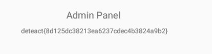

## Mobile WRITEUP

### 1. DroidForum

Анализируя файл с помощью MobSF, видно что страница форума подгружается из локального html

`this.z.loadUrl("file:///android_asset/index.html?nickname=" + stringExtra);`

Распакуем apk с apktool и в папке assets увидим, что есть backup этой странички.
Откроем его и увидим комментарий в формате base64

```
<tr />-->
    ZGV0ZWFjdHtiM2Q4MzdjYTNlMTkyZTljMGE2ZTc3ZWIwYjI2ODczMH0K
    <!--<article>
```

Расшифруем его и получим первый флаг.

`'deteact{b3d837ca3e192e9c0a6e77eb0b268730}'`

### 2. DroidForum Admin

Прочитав AndroidManifest.xml увидим, что для вызова доступны несколько Activity.
А DeepLinkActivity обладает определенной схемой с хостом.
```
<activity android:name="com.example.droidforum.DeeplinkActivity">
            <intent-filter>
                <action android:name="android.intent.action.VIEW" />
                <category android:name="android.intent.category.DEFAULT" />
                <category android:name="android.intent.category.BROWSABLE" />
                <data android:scheme="droidforum" android:host="forum" />
            </intent-filter>
        </activity>
        <activity android:name="com.example.droidforum.AdminForumActivity">
            <intent-filter>
                <action android:name="android.intent.action.VIEW" />
                <category android:name="android.intent.category.DEFAULT" />
            </intent-filter>
        </activity>
```

Анализируя код, найдем, что для доступа к админке необходимо соответсвие схемы из DeepLink, а также параметром передается токен, который проверяется на корректность.

`if (intent != null && "android.intent.action.VIEW".equals(intent.getAction()) && (data = intent.getData()) != null && "droidforum".equals(data.getScheme()) && "forum".equals(data.getHost()) && "/admin".equals(data.getPath()) && (queryParameter = data.getQueryParameter("token")) != null && Uri.parse(queryParameter).getHost() != null) {`

Прочитав с помощью MobSF R.string.s1 получим следующую последовательность:

`"s1" : "c429592708a3f9a5786637"`

В коде к нему прибавляется еще часть.

```
String queryParameter = data.getQueryParameter("token");
            if (!(getResources().getString(R.string.s1) + "3e36b52e71").equals(queryParameter)) {
                this.z.setText(R.string.token_incorrect);
                return;
```

Наш итоговый токен будет иметь вид:

`c429592708a3f9a57866373e36b52e71`

С помощью android manager (am) запустим AdminForumActivity передав схему DeepLink с полученным токеном

`
adb -s 127.0.0.1:5555 shell am start -W -a android.intent.action.VIEW -d "droidforum://forum/admin?token=c429592708a3f9a57866373e36b52e71" -n com.example.droidforum/com.example.droidforum.AdminForumActivity
`

Из админки возьмем второй флаг.



deteact{8d125dc38213ea6237cdec4b3824a9b2}
