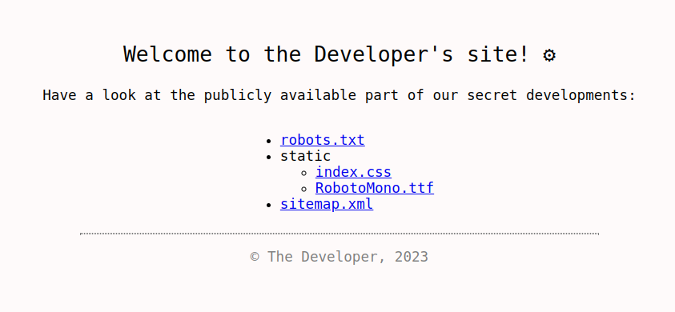
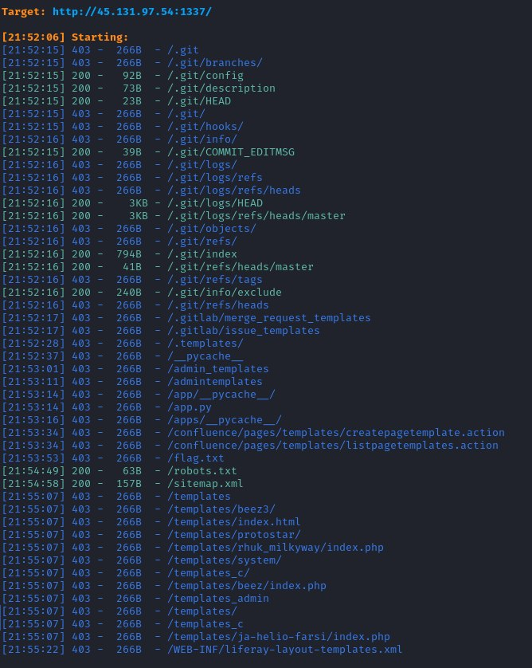
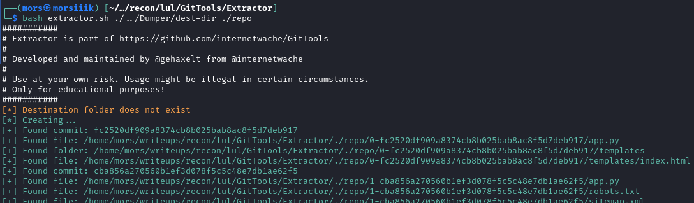
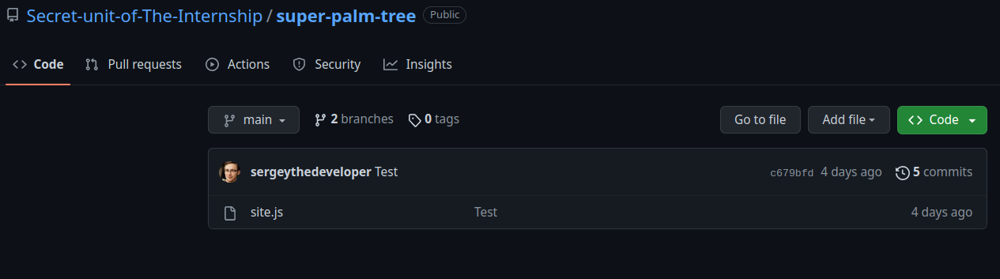
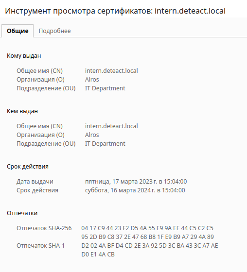
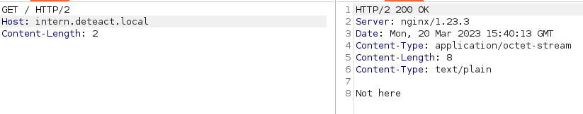
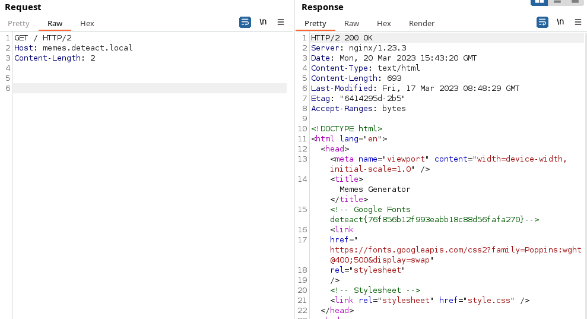
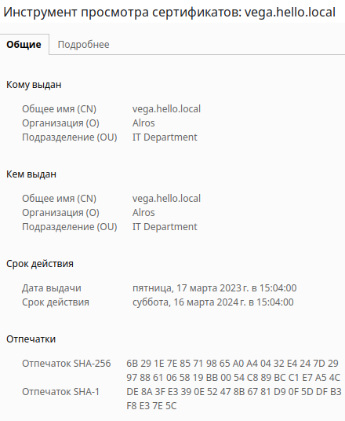
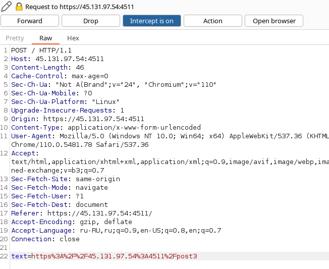

## RECON WRITEUP

### 1. The Developer's site

Из описания таска нас перекидывает на сайт по адресу http://45.131.97.54:1337:

В доступной на сайте информации нет ничего интересного,
с помощью утилиты dirsearch посмотрим доступные скрытые файлы:

`python3 dirsearch.py -u https://45.131.97.54/`

Изучив доступные файлы, найдем в .git/logs/refs/heads автора коммитов **sergeythedeveloper**
но об этом позже.

Увидим, что на сайте находится git репозиторий, его можно попробовать выкачать с помощью
утилиты Dumper из набора GitTools:

`./gitdumper.sh http://45.131.97.54:1337/.git/ dest-dir`

В репозитории не нашлось ничего интересного, с помощью утилиты Extractor из того же набора, поищем удаленные файлы:

В папке одного из коммитов находится файл flag.txt с флагом.

`Top secret development: deteact{fc9403e6e7f917e5bac324c92cc5d5bb}`

### 2. The Developer's story

Вернемся к автору коммитов **sergeythedeveloper**, найденному в предыдущем задании.

Найдем его на github:

Пролистав его активность, до 2012 года, увидим доступный репозиторий.
Посмотрим что там содержится:

В одном из коммитов на ветке secret по адресу https://github.com/Secret-unit-of-The-Internship/super-palm-tree/commit/a9f8f3d229cda66df4dfce3d2a2f923297039215
найдем флаг в виде массива:

`var secret = ['d', 'e', 't', 'e', 'a', 'c', 't', '{', '6', '6', '2', '8', 'e', '6', '3', 'f', 'f', '0', 'e', '7', 'e', 'd', '4', '5', '1', 'f', '7', '6', '0', 'b', '3', '2', '5', '5', 'a', '1', 'c', '0', '8', 'a', '}'];`

Преобразуем его в читабельный вид:

`deteact{6628e63ff0e7ed451f760b3255a1c08a}`

### 3. Find Meme Generator

Открыв ссылку из описания таска, мы ничего не увидим, кроме того, что соединение устанавливается по ssl. Посмотрим информацию, содержащуюся в сертификате:

Попробуем поставить имя домена из сертификата с помощью burp:

Переберем поддомены и найдем поддомен memes.
Подставим memes вместо intern, и получим флаг:

`deteact{76f856b12f993eabb18c88d56fafa270}`

### 4. Virtual Peace

Изучая сайт по адресу https://45.131.97.54:4511 из дано, увидим сертификат, выписанный на имя **vega.hello.local**:

А также, перехватив посылаемый запрос через burp увидим возможность ssrf:

Поднимем локально http сервер, и после подменим поле text, выполнив запрос на свой сервер.

`Serving HTTP on 0.0.0.0 port 8000 (http://0.0.0.0:8000/) ...`

`79.143.25.24 - - [19/Mar/2023 20:57:03] "GET / HTTP/1.1" 200 -`

Перейдя по адресу 79.143.25.24 получим сообщение nothing here.
Но указав имя хоста vega.hello.local из сертификата получим флаг.

`deteact{e1a3451c808b5db0d81c2f56e4943921}`
